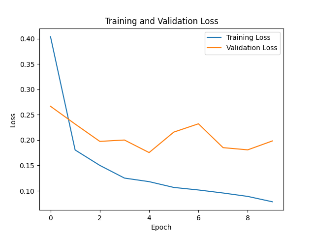
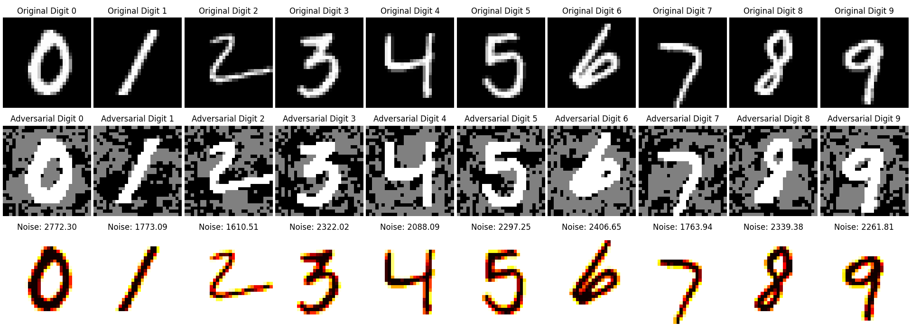

# Assignment Report

## Part-I : Building and Evaluating an ANN Model

### Data Preparation: 

- As suggested in the document, I used the popular Modified National Institute of Standards and Technology (MNIST) database. MNIST is a standard computer vision and machine learning dataset. It consists of handwritten digits from 0 to 9 as 28x28 pixel (array/matrix) images with each value of the matrix, describing the intensity (0 `white` to 255 `black`) of the pixel. The higher the value, the darker the pixel.

- Each array can be flattened into a 28x28 = 784 dimensional (or, feature) vector. Thus, we can generally think of MNIST as being a collection of 784-dimensional vectors. Overall, it is a collection of 70000 images, which I divided into 42000 and 28000 images to create a 60:40 split for training and testing data respectively.

- To do this, execute the following command:

```sh
python3 split_mnist_data.py
```

- This will automatically use the MNIST dataset, create two directories - namely `train data` and `test data`, and store training and testing data in 60:40 ratio, as required for this assignment.

### Model Implementation: 

- I have implemented the code for creating a Artifical Neural Network (ANN) using Keras API in `classify.py`. The code is redundant as the same model is implemented in `model.py` using PyTorch. To use it, execute the following command:

```sh
python3 classify.py
```

- This will create a model with the following specifications:

#### Model Structure

| Layer Type      | Output Shape | Activation Function |
|-----------------|--------------|---------------------|
| Input           | (784,)       | None                |
| Dense           | (128,)       | ReLU                |
| Dense           | (64,)        | ReLU                |
| Dense (Output)  | (10,)        | Softmax             |

- **Input Layer**: Consists of 784 units corresponding to the dimensionality of the input data.
- **Hidden Layers**: Two dense (fully connected) layers with 128 and 64 units, respectively, using ReLU activation function.
- **Output Layer**: Dense layer with 10 units and softmax activation function suitable for multi-class classification tasks.

#### Hyperparameters

| Parameter     | Value  |
|---------------|--------|
| Learning Rate | 0.001  |
| Batch Size    | 32     |
| Epochs        | 10     |

- **Learning Rate**: 0.001 (determines the step size during optimization).
- **Batch Size**: 32 (number of samples processed before updating the model).
- **Epochs**: 10 (number of times the entire dataset is passed through the network during training).

- The above code will store the model as `untrained_ANN_Model.keras` before training, and `trained_ANN_Model.keras` after training, both of which I will not use in this assignment anyways.

### Model Training:

- The code for the actual model that I will use for this assignment is present in `model.py` - the template, for which, was already provided to us as a boilerplate code, in this assignment. To use it, execute the following command:

```sh
python3 model.py
```

- This will automatically create an ANN and train it, on the 60:40 splitted MNIST dataset I created before, with the following specifications:

#### Model Structure

| Layer Type      | Output Shape | Activation Function |
|-----------------|--------------|---------------------|
| Linear (FC1)    | (784, 128)   | ReLU                |
| Linear (FC2)    | (128, 64)    | ReLU                |
| Linear (FC3)    | (64, 10)     | None (Output)       |

- **Input Layer**: The input is flattened to 784 units.
- **Hidden Layers**: Two fully connected (linear) layers with 128 and 64 units, respectively, using ReLU activation.
- **Output Layer**: Fully connected layer with 10 units (number of classes) and no activation.

#### Hyperparameters

| Parameter     | Value  |
|---------------|--------|
| Learning Rate | 0.001  |
| Batch Size    | 32     |
| Epochs        | 10     |

- **Learning Rate**: 0.001 (Adam optimizer default).
- **Batch Size**: 32.
- **Epochs**: 10.

#### Model Training

- Training data in `train data` directory is split into training and validation sets with a validation split of 0.2.
- Training progress is displayed using tqdm progress bar on the terminal. 
- Model is trained for 10 epochs using Adam optimizer and cross-entropy loss function.
- The following observations were recorded:
  
| Epoch | Loss   | Training Accuracy | Validation Accuracy |
|-------|--------|-------------------|---------------------|
| 1     | 0.3942 | 89.97%            | 93.55%              |
| 2     | 0.1817 | 94.85%            | 95.12%              |
| 3     | 0.1441 | 95.68%            | 95.14%              |
| 4     | 0.1275 | 96.32%            | 95.93%              |
| 5     | 0.1128 | 96.75%            | 95.77%              |
| 6     | 0.1010 | 97.07%            | 95.64%              |
| 7     | 0.0971 | 97.32%            | 95.73%              |
| 8     | 0.0883 | 97.49%            | 95.86%              |
| 9     | 0.0806 | 97.60%            | 95.86%              |
| 10    | 0.0823 | 97.73%            | 96.21%              |

#### Model Saving

- The final trained model is saved as `model.pth` and used later in the assignment.

### Model Evaluation:

- The performance of this trained model was also evaluated based on its accuracy in classifying the test data. The final test accuracy recorded was 96.17%.

### Analysis and Improvement:

To enhance the accuracy and robustness of this ANN classifier, several techniques and strategies can be employed:

1. **Data Augmentation**: Increase the diversity of training data by applying transformations like rotation, scaling, and flipping to improve the model's ability to generalize.

2. **Normalization**: Standardize input data using techniques such as Z-score normalization or min-max scaling to improve convergence and make the model less sensitive to input scale variations.

3. **Learning Rate Scheduling**: Adjust the learning rate during training using techniques like learning rate decay or adaptive methods such as Adam with dynamic learning rates to improve convergence and prevent overshooting.

4. **Regularization**: Add L1 or L2 regularization to prevent overfitting and improve generalization. Dropout regularization can also be effective in preventing co-adaptation of neurons.

5. **Model Architecture**: Experiment with different architectures, including varying the number of layers, neurons per layer, and activation functions, to find a structure that captures underlying patterns more effectively.

6. **Ensemble Learning**: Combine predictions from multiple models using techniques like bagging, boosting, or stacking to improve overall performance.

7. **Hyperparameter Tuning**: Systematically search through different hyperparameter combinations using techniques like grid search or random search to find optimal configurations for the model.

8. **Early Stopping**: Monitor validation loss during training and stop when it starts increasing to prevent overfitting and improve generalization.

9. **Batch Normalization**: Add batch normalization layers to stabilize and accelerate training by reducing internal covariate shift and smoothing the optimization landscape.

10. **Gradient Clipping**: Limit the magnitude of gradients during training (gradient clipping) to prevent exploding gradients and improve training stability.

### Performance Metrics:

- The final training, test, and validation accuracy of the model is depicted in the following table:

| Metric               | Accuracy |
|----------------------|----------|
| Training Accuracy    | 97.73%   |
| Validation Accuracy  | 96.21%   |
| Test Accuracy        | 96.17%   |

- To plot the validation loss and training loss, to visualize the model’s performance during training, I augmented the code to plot the required graph using `matplotlib`. The obtained graph is shown below:



## Part-II: Generating Adversarial Examples

- Evasion Rate is a metric used to measure the evasiveness of adversarial examples against a trained ML model. The Evasion rate produced by my model is 91.40%. Note that this evasion rate is variable and can change depending on the attack parameters of the FGSM and the input parameters of the model.

- Then I picked random images of all ten digits and created a plot to show the corresponding adversarial examples and the corresponding adversarial noise. The plot is 3 ∗ 10 in dimensions - The first row shows original images of ten different digits, the second row shows their corresponding adversarial examples, and the final row shows the L2 norm of their difference (L2 norm of the adversarial noise):



- To perform the final part, I used the `random` module of Python to randomly choose a digit between 0 to 9 and then created a function called `find_most_misclassified_digit` to scale up this experiment. Some of the results are:

```txt
Most misclassified class for digit 9 is: 8
Most misclassified class for digit 4 is: 8
Most misclassified class for digit 0 is: 8
Most misclassified class for digit 3 is: 8
```

- We can clearly see the structural similarites between the misclassified examples. For an instance, The digit 9 is different from 8 in just the bottom half. I observed that most of the misclassifcations occured between digits that have high correlation in their structure.

__<u>Note:</u>__ Before running any code, please ensure that you have the following Python dependencies installed:

#### Dependencies:

```sh
pip3 install numpy 
pip3 install pandas
pip3 install matplotlib
pip3 install scikit-learn
pip3 install keras
pip3 install tensorflow
pip3 install torch torchvision torchaudio
pip3 install torchsummary
```